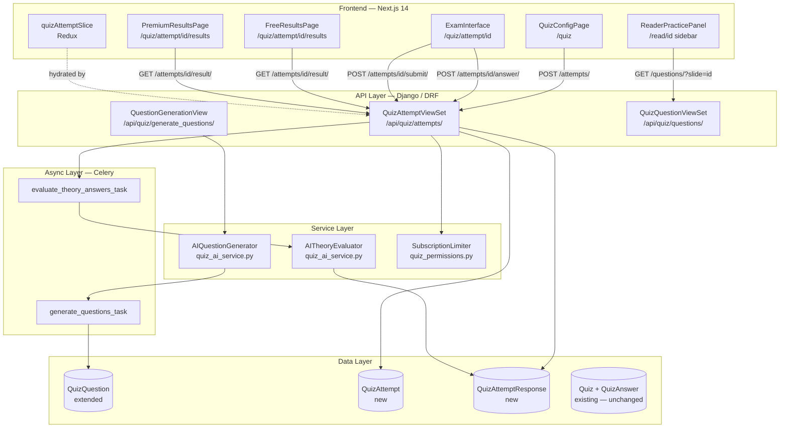
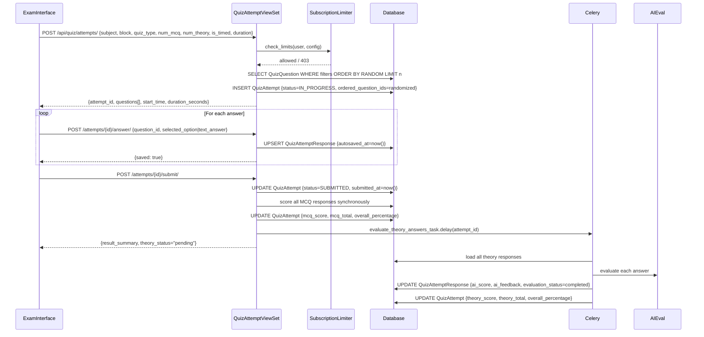
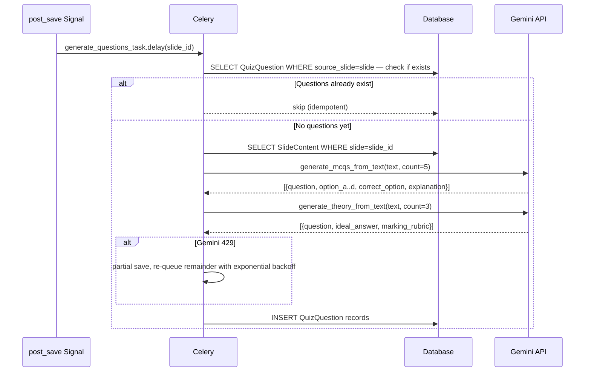
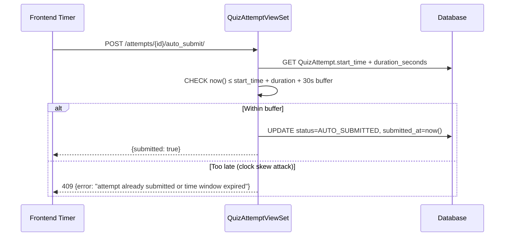

# Design Document: Quiz / Examination System

## Overview

The Quiz/Examination System is the assessment engine for the Emby medical-school study platform. It replaces the existing prototype quiz infrastructure with a production-grade engine that handles two distinct use modes — quick slide-practice inside the reader, and full timed or untimed examinations launched from the `/quiz` page — while enforcing per-tier limits server-side and delivering AI-graded theory answers via Celery.

The system extends the existing `QuizQuestion`, `Quiz`, and `QuizAnswer` models rather than replacing them, and introduces two new first-class models: `QuizAttempt` (the exam session) and `QuizAttemptResponse` (one student answer per question per attempt). All subscription enforcement is handled on the backend by reading `UserProfile.subscription_tier` and `class_head_verified`; the frontend treats premium state as read-only from the JWT payload. AI theory evaluation runs asynchronously after submission so the student sees their score within seconds rather than waiting during the exam itself.

The architecture keeps the Django monolith pattern the rest of the project uses: DRF ViewSets + function-based API views, Celery tasks for async work, and Next.js 14 App Router pages with a Redux store slice for quiz state.

---

## Architecture



---

## Sequence Diagrams

### Exam Attempt Lifecycle



### Question Generation (post slide processing)



### Timer Auto-Submit



---

## Components and Interfaces

### Backend Components

#### QuizAttemptViewSet

**Purpose**: Core CRUD + action ViewSet for the entire attempt lifecycle.

**Interface**:

```python
class QuizAttemptViewSet(viewsets.ModelViewSet):
    permission_classes = [IsAuthenticated]
    serializer_class = QuizAttemptSerializer

    def create(self, request)           # POST /attempts/
    def retrieve(self, request, pk)     # GET  /attempts/{id}/

    @action(methods=['post'], detail=True)
    def answer(self, request, pk)       # POST /attempts/{id}/answer/

    @action(methods=['post'], detail=True)
    def flag(self, request, pk)         # POST /attempts/{id}/flag/

    @action(methods=['post'], detail=True)
    def submit(self, request, pk)       # POST /attempts/{id}/submit/

    @action(methods=['post'], detail=True)
    def auto_submit(self, request, pk)  # POST /attempts/{id}/auto_submit/

    @action(methods=['get'], detail=True)
    def result(self, request, pk)       # GET  /attempts/{id}/result/

    @action(methods=['get'], detail=True)
    def missed(self, request, pk)       # GET  /attempts/{id}/missed/ (premium)

    @action(methods=['post'], detail=True)
    def flashcards(self, request, pk)   # POST /attempts/{id}/flashcards/ (premium)

    @action(methods=['get'], detail=True)
    def analysis(self, request, pk)     # GET  /attempts/{id}/analysis/ (premium)
```

**Responsibilities**:

- Validate subscription limits before creating an attempt
- Randomize question order and option order at creation time
- Score MCQ responses deterministically on submission
- Queue Celery task for theory evaluation after submission
- Gate premium endpoints using `SubscriptionLimiter.is_premium(user)`

---

#### SubscriptionLimiter

**Purpose**: Single authoritative place for all tier checks and limits.

**Interface**:

```python
class SubscriptionLimiter:
    MCQ_LIMIT_FREE     = 5
    MCQ_LIMIT_PREMIUM  = 100
    THEORY_LIMIT_FREE  = 1
    THEORY_LIMIT_PREMIUM = 10

    @staticmethod
    def is_premium(user: User) -> bool:
        """
        True if subscription_tier == 'premium'
        OR (role == 'class_head' AND class_head_verified == True).
        Reads from UserProfile; never trusts frontend payload.
        """

    @staticmethod
    def check_limits(user: User, num_mcq: int, num_theory: int) -> None:
        """Raise PermissionDenied with descriptive message if limits exceeded."""

    @staticmethod
    def premium_feature(user: User, feature_name: str) -> None:
        """Raise PermissionDenied if user is not premium."""
```

---

#### AIQuestionGenerator

**Purpose**: Wraps Gemini calls for question generation with 429 handling and idempotency guard.

**Interface**:

```python
class AIQuestionGenerator:
    @staticmethod
    def generate_mcqs_from_text(
        text: str,
        slide: Slide,
        topic: Optional[Topic],
        count: int = 5,
    ) -> List[Dict[str, Any]]:
        """
        Returns list of MCQ dicts.
        On 429: returns whatever was generated so far (partial), logs warning.
        Caller (Celery task) re-queues remaining count.
        """

    @staticmethod
    def generate_theory_from_text(
        text: str,
        slide: Slide,
        topic: Optional[Topic],
        count: int = 3,
    ) -> List[Dict[str, Any]]:
        """
        Returns list of theory dicts with ideal_answer and marking_rubric.
        marking_rubric format: {criterion: str, marks: int}[]
        On 429: same partial-return behaviour.
        """

    @staticmethod
    def questions_exist_for_slide(slide_id: str, question_type: str) -> bool:
        """Returns True if DB already has ≥1 question of this type for this slide."""
```

---

#### AITheoryEvaluator

**Purpose**: Grades a student's theory answer against the ideal answer and rubric.

**Interface**:

```python
class AITheoryEvaluator:
    @staticmethod
    def evaluate(
        question_text: str,
        student_answer: str,
        ideal_answer: str,
        marking_rubric: List[Dict],
        maximum_marks: int,
    ) -> Dict[str, Any]:
        """
        Returns structured grading dict (see data models).
        On any failure: returns {"error": str, "score": None} — never a fake score.
        On 429: raises GeminiQuotaExceeded for Celery to retry with backoff.
        """
```

---

### Frontend Components

#### QuizConfigPage (`/quiz`)

**Purpose**: Entry point for starting a new exam attempt. Replaces the existing `quiz/page.tsx` prototype.

**Interface**:

```typescript
interface QuizConfig {
  subject: string;
  block: string | null;
  topic: string | null;
  examType: "mcq_only" | "theory_only" | "mixed";
  numMcq: number;
  numTheory: number;
  isTimed: boolean;
  durationMinutes: number;
}

interface QuizConfigPageProps {} // no props — page component
```

**Responsibilities**:

- Cascading Subject → Block → Topic selectors (reuse existing API calls)
- Exam type cards with free/premium gating displayed in-line
- Slider for question count, capped by tier (read from Redux `user.profile.is_premium`)
- Timed toggle with duration selector (15 / 30 / 45 / 60 / 90 min)
- On submit: `POST /api/quiz/attempts/` → redirect to `/quiz/attempt/${id}`

---

#### ExamInterface (`/quiz/attempt/[id]`)

**Purpose**: The main examination UI. Renders MCQ and theory questions, timer, navigator grid, and flag controls.

**Interface**:

```typescript
interface ExamInterfaceProps {
  params: { id: string };
}

interface NavigatorItem {
  questionId: string;
  index: number;
  status: "unanswered" | "answered" | "flagged" | "answered_flagged";
}

interface TimerState {
  secondsRemaining: number;
  isExpired: boolean;
  warningThreshold: number; // 300s — timer turns red
}
```

**Responsibilities**:

- Load attempt state on mount via `GET /api/quiz/attempts/{id}/`
- MCQ questions: radio-button option grid, disable after submission
- Theory questions: `<textarea>` with live word count, 50-word minimum hint
- Question navigator grid: 10×N grid of colored chips (unanswered/answered/flagged)
- Flag toggle — persisted via `POST /attempts/{id}/flag/`
- Countdown timer; auto-submits on expiry via `POST /attempts/{id}/auto_submit/`
- Autosave on every answer change (debounced 500ms)
- Warn on tab-close / navigation if attempt is in-progress
- Focus mode toggle (full-screen overlay, hides app chrome)

---

#### ResultsPage (`/quiz/attempt/[id]/results`)

**Purpose**: Shows score, breakdown, and premium analysis after submission.

**Interface**:

```typescript
interface ResultsPageProps {
  params: { id: string };
}

// Free tier result shape
interface FreeResult {
  overall_percentage: number;
  mcq_score: number;
  mcq_total: number;
  theory_pending: boolean; // true until Celery completes
  passed: boolean; // ≥ 50%
}

// Premium result adds:
interface PremiumResult extends FreeResult {
  theory_score: number;
  theory_total: number;
  topic_breakdown: TopicBreakdown[];
  missed_questions: MissedQuestion[];
  ai_recommendations: string[];
}

interface TopicBreakdown {
  topic_name: string;
  correct: number;
  total: number;
  percentage: number;
}

interface MissedQuestion {
  question_text: string;
  your_answer: string | null;
  correct_answer: string;
  explanation: string;
  ideal_answer?: string; // theory only
  ai_feedback?: AiFeedback; // theory only
}
```

**Responsibilities**:

- Poll `GET /attempts/{id}/result/` every 3s while `theory_pending === true` (max 60s)
- Free view: score badge, MCQ percentage, theory "grading in progress" chip, retake button
- Premium view: topic performance bar chart, missed question review, AI recommendations
- Share score card (image export of score badge)

---

#### ReaderPracticePanel

**Purpose**: Slide-contextual quick-practice modal shown in the reader sidebar.

**Interface**:

```typescript
interface ReaderPracticePanelProps {
  slideId: string;
  isOpen: boolean;
  onClose: () => void;
}

interface PracticeQuestion {
  id: string;
  question_text: string;
  question_type: "mcq" | "theory";
  option_a?: string;
  option_b?: string;
  option_c?: string;
  option_d?: string;
  correct_option?: string;
  explanation?: string;
}
```

**Responsibilities**:

- Load questions via `GET /api/quiz/questions/?slide={slideId}`
- MCQ: tap-to-select with immediate reveal (no timer, no attempt created)
- Theory: show model answer on toggle (practice mode, not graded)
- "Start full exam on this topic" CTA that pre-fills QuizConfigPage with the slide's topic

---

## Data Models

### Extended: QuizQuestion (migration, no rename)

```python
# New fields added via migration 0002_extend_quizquestion.py
class QuizQuestion(models.Model):
    # ... existing fields unchanged ...

    # New fields
    ideal_answer = models.TextField(blank=True)
    # Structured model answer for AI evaluation reference

    marking_rubric = models.JSONField(default=list, blank=True)
    # Format: [{"criterion": "Describes the brachial plexus roots", "marks": 4}, ...]
    # Total marks must equal maximum_marks

    maximum_marks = models.IntegerField(default=20)
    # Per-question maximum for theory; ignored for MCQ (always 1)

    source_text = models.TextField(blank=True)
    # Raw slide text that was used to generate this question (audit trail)

    question_options_order = models.JSONField(default=list, blank=True)
    # Per-attempt option shuffling stored here as the canonical shuffle seed
    # Format: ["A", "C", "B", "D"] — used by attempt creation to randomize
```

---

### New: QuizAttempt

```python
class QuizAttempt(models.Model):
    """
    One exam session.  Replaces the legacy Quiz model for new attempts.
    Legacy Quiz records are preserved for backwards compatibility.
    """

    class Status(models.TextChoices):
        IN_PROGRESS    = "in_progress",    "In Progress"
        SUBMITTED      = "submitted",      "Submitted"
        AUTO_SUBMITTED = "auto_submitted", "Auto-Submitted (timer)"

    id = models.UUIDField(primary_key=True, default=uuid.uuid4, editable=False)

    user = models.ForeignKey(
        User, on_delete=models.CASCADE, related_name="quiz_attempts"
    )

    # Exam configuration snapshot (immutable after creation)
    configuration = models.JSONField()
    # Shape:
    # {
    #   "subject_id": str, "block_id": str|null, "topic_id": str|null,
    #   "exam_type": "mcq_only"|"theory_only"|"mixed",
    #   "num_mcq": int, "num_theory": int,
    #   "is_timed": bool, "duration_seconds": int|null
    # }

    status = models.CharField(
        max_length=20, choices=Status.choices, default=Status.IN_PROGRESS
    )

    # Timing
    start_time  = models.DateTimeField(auto_now_add=True)
    end_time    = models.DateTimeField(null=True, blank=True)   # wall-clock deadline
    submitted_at = models.DateTimeField(null=True, blank=True)

    # Scores (populated on submission)
    mcq_score        = models.IntegerField(null=True, blank=True)
    mcq_total        = models.IntegerField(null=True, blank=True)
    theory_score     = models.IntegerField(null=True, blank=True)
    theory_total     = models.IntegerField(null=True, blank=True)
    overall_percentage = models.FloatField(null=True, blank=True)
    # overall = 0.5 * mcq_pct + 0.5 * theory_pct
    # If only one type: overall = that type's pct

    # Question ordering (randomized at creation, immutable after)
    ordered_question_ids = models.JSONField(default=list)
    # ["q_id_1", "q_id_2", ...] — defines display order

    # Flagged questions (mutable during attempt)
    flagged_questions = models.JSONField(default=list)
    # ["q_id_1", "q_id_7", ...]

    created_at = models.DateTimeField(auto_now_add=True)
    updated_at = models.DateTimeField(auto_now=True)

    class Meta:
        ordering = ["-created_at"]
        indexes = [
            models.Index(fields=["user", "status"]),
            models.Index(fields=["user", "-created_at"]),
        ]

    def __str__(self):
        return f"{self.user.username} — {self.status} ({self.created_at.date()})"

    @property
    def is_expired(self) -> bool:
        if not self.end_time:
            return False
        from django.utils import timezone
        return timezone.now() > self.end_time

    @property
    def theory_grading_complete(self) -> bool:
        return not self.responses.filter(
            response_type="theory",
            evaluation_status="pending"
        ).exists()
```

---

### New: QuizAttemptResponse

```python
class QuizAttemptResponse(models.Model):
    """
    One student answer for one question within a QuizAttempt.
    Created on first save (autosave) and updated on subsequent changes.
    """

    class EvaluationStatus(models.TextChoices):
        PENDING   = "pending",   "Pending AI Evaluation"
        COMPLETED = "completed", "AI Evaluation Complete"
        FAILED    = "failed",    "AI Evaluation Failed"
        NA        = "na",        "Not Applicable (MCQ)"

    attempt  = models.ForeignKey(
        QuizAttempt, on_delete=models.CASCADE, related_name="responses"
    )
    question = models.ForeignKey(
        "QuizQuestion", on_delete=models.CASCADE, related_name="attempt_responses"
    )
    response_type = models.CharField(
        max_length=10, choices=[("mcq", "MCQ"), ("theory", "Theory")]
    )

    # MCQ fields
    selected_option  = models.CharField(max_length=1, blank=True)  # A / B / C / D
    is_correct       = models.BooleanField(null=True, blank=True)   # null until scored
    correct_option   = models.CharField(max_length=1, blank=True)   # copied from question on score

    # Theory fields
    text_answer       = models.TextField(blank=True)
    word_count        = models.IntegerField(default=0)
    ai_score          = models.IntegerField(null=True, blank=True)   # 0..maximum_marks
    ai_max_score      = models.IntegerField(null=True, blank=True)   # mirrors question.maximum_marks
    ai_feedback       = models.JSONField(null=True, blank=True)
    # Shape:
    # {
    #   "strengths":          ["..."],
    #   "missing_points":     ["..."],
    #   "incorrect_points":   ["..."],
    #   "feedback":           "overall narrative",
    #   "recommended_revision": "...",
    #   "rubric_breakdown":   {"criterion_text": marks_awarded, ...}
    # }
    evaluation_status = models.CharField(
        max_length=10,
        choices=EvaluationStatus.choices,
        default=EvaluationStatus.NA,
    )

    # Timestamps
    autosaved_at = models.DateTimeField(null=True, blank=True)
    answered_at  = models.DateTimeField(null=True, blank=True)

    class Meta:
        unique_together = [("attempt", "question")]
        indexes = [
            models.Index(fields=["attempt", "response_type"]),
            models.Index(fields=["evaluation_status"]),
        ]

    def __str__(self):
        return f"Attempt {self.attempt_id} Q {self.question_id} [{self.response_type}]"
```

---

## API Contracts

### POST `/api/quiz/attempts/` — Create Attempt

**Request**:

```json
{
  "subject": "anatomy",
  "block": "anatomy-block-1",
  "topic": null,
  "exam_type": "mixed",
  "num_mcq": 10,
  "num_theory": 3,
  "is_timed": true,
  "duration_minutes": 30
}
```

**Response 201**:

```json
{
  "id": "550e8400-e29b-41d4-a716-446655440000",
  "status": "in_progress",
  "start_time": "2025-01-15T09:00:00Z",
  "end_time": "2025-01-15T09:30:00Z",
  "duration_seconds": 1800,
  "configuration": { ... },
  "questions": [
    {
      "id": "q_abc123",
      "index": 1,
      "question_type": "mcq",
      "question_text": "Which nerve supplies the axilla?",
      "shuffled_options": {
        "A": "Ulnar nerve",
        "B": "Median nerve",
        "C": "Long thoracic nerve",
        "D": "Radial nerve"
      },
      "difficulty": "medium",
      "maximum_marks": 1
    }
    // ... no correct_option, no ideal_answer, no explanation exposed pre-submission
  ]
}
```

**Errors**:

- `400` — missing required field or zero questions match the filters
- `403` — subscription limits exceeded (`{"error": "...", "upgrade_required": true}`)
- `429` — attempt already in progress for this user (max 1 concurrent attempt)

---

### POST `/api/quiz/attempts/{id}/answer/` — Save Answer

**Request**:

```json
{
  "question_id": "q_abc123",
  "selected_option": "C",
  "time_taken_seconds": 45
}
```

_Or for theory:_

```json
{
  "question_id": "q_theory456",
  "text_answer": "The long thoracic nerve (C5-C7) supplies the serratus anterior...",
  "time_taken_seconds": 120
}
```

**Response 200**:

```json
{
  "saved": true,
  "autosaved_at": "2025-01-15T09:12:30Z"
}
```

**Errors**:

- `400` — attempt already submitted
- `403` — question not part of this attempt
- `404` — attempt not found

---

### POST `/api/quiz/attempts/{id}/submit/` — Manual Submit

**Request**: `{}` (empty body)

**Response 200**:

```json
{
  "status": "submitted",
  "submitted_at": "2025-01-15T09:28:00Z",
  "mcq_score": 8,
  "mcq_total": 10,
  "overall_percentage": 55.0,
  "theory_status": "pending",
  "result_url": "/quiz/attempt/550e8400.../results"
}
```

---

### POST `/api/quiz/attempts/{id}/auto_submit/` — Timer Expiry

**Request**: `{}`

**Response 200**: Same shape as submit.

**Response 409**: `{"error": "Attempt already submitted or submission window has expired."}`

---

### GET `/api/quiz/attempts/{id}/result/` — Get Results

**Response 200 (free tier)**:

```json
{
  "id": "550e8400...",
  "status": "submitted",
  "overall_percentage": 55.0,
  "mcq_score": 8,
  "mcq_total": 10,
  "theory_pending": true,
  "passed": true,
  "premium_required": true,
  "upgrade_message": "Upgrade to Premium to see topic analysis, missed questions, and AI feedback."
}
```

**Response 200 (premium)**:

```json
{
  "id": "550e8400...",
  "status": "submitted",
  "overall_percentage": 72.5,
  "mcq_score": 8,
  "mcq_total": 10,
  "theory_score": 14,
  "theory_total": 20,
  "theory_pending": false,
  "passed": true,
  "topic_breakdown": [
    {
      "topic_name": "Gross Anatomy",
      "correct": 6,
      "total": 8,
      "percentage": 75.0
    }
  ],
  "responses": [
    {
      "question_id": "q_abc123",
      "question_text": "Which nerve supplies the axilla?",
      "question_type": "mcq",
      "your_answer": "C",
      "correct_answer": "C",
      "is_correct": true,
      "explanation": "The long thoracic nerve arises from C5-C7..."
    }
  ]
}
```

---

### GET `/api/quiz/attempts/{id}/missed/` — Missed Questions (Premium)

**Response 200**:

```json
{
  "missed": [
    {
      "question_id": "q_xyz789",
      "question_text": "Describe the boundaries of the axilla",
      "question_type": "theory",
      "your_answer": "The axilla is bounded by...",
      "ideal_answer": "The axilla has five walls: ...",
      "ai_score": 9,
      "ai_max_score": 20,
      "ai_feedback": {
        "strengths": ["Correctly identified the anterior wall"],
        "missing_points": [
          "Failed to mention the posterior wall (subscapularis, teres major, latissimus dorsi)"
        ],
        "incorrect_points": [],
        "feedback": "Good start but incomplete coverage of all five walls.",
        "recommended_revision": "Review Grant's Atlas, Chapter 3, axilla boundaries",
        "rubric_breakdown": {
          "Anterior wall (pectoralis major/minor)": 4,
          "Posterior wall (subscapularis, teres major, lat dorsi)": 0,
          "Medial wall (serratus anterior, ribs 1-4)": 3,
          "Lateral wall (intertubercular groove)": 2,
          "Apex and base": 0
        }
      }
    }
  ]
}
```

---

### POST `/api/quiz/attempts/{id}/flashcards/` — Create Flashcards from Missed (Premium)

**Request**: `{}`

**Response 201**:

```json
{
  "created": 4,
  "flashcard_ids": ["fl_001", "fl_002", "fl_003", "fl_004"],
  "deck_url": "/flashcards"
}
```

---

### GET `/api/quiz/attempts/{id}/analysis/` — Topic Performance (Premium)

**Response 200**:

```json
{
  "attempt_id": "550e8400...",
  "topic_performance": [
    {
      "topic_id": "gross-anatomy",
      "topic_name": "Gross Anatomy",
      "mcq_correct": 4,
      "mcq_total": 5,
      "theory_score": 14,
      "theory_total": 20,
      "combined_percentage": 75.0,
      "mastery_level": "review"
    }
  ],
  "recommendations": [
    "Strengthen posterior axilla wall anatomy — missed in 2 questions",
    "Theory answers lack clinical relevance examples"
  ]
}
```

---

### POST `/api/quiz/generate_questions/` — Trigger Question Generation

**Request**:

```json
{
  "slide_id": "sl_abc123",
  "num_mcq": 5,
  "num_theory": 3,
  "force_regenerate": false
}
```

**Response 202**:

```json
{
  "task_id": "celery-task-uuid",
  "slide_id": "sl_abc123",
  "message": "Question generation queued"
}
```

**Response 200** (already exist, `force_regenerate=false`):

```json
{
  "message": "Questions already exist for this slide",
  "mcq_count": 5,
  "theory_count": 3
}
```

---

### GET `/api/quiz/questions/` — Questions for Slide (Reader Practice)

**Query params**: `slide=<slide_id>`, `type=mcq|theory`

**Response 200**:

```json
{
  "questions": [
    {
      "id": "q_abc123",
      "question_type": "mcq",
      "question_text": "Which nerve supplies the axilla?",
      "option_a": "Ulnar nerve",
      "option_b": "Median nerve",
      "option_c": "Long thoracic nerve",
      "option_d": "Radial nerve",
      "correct_option": "C",
      "explanation": "The long thoracic nerve (C5-C7)...",
      "difficulty": "medium"
    }
  ],
  "total": 5
}
```

_Note: `correct_option` and `explanation` are exposed here because this is practice mode, not an active attempt._

---

## Algorithmic Pseudocode

### Attempt Creation Algorithm

```pascal
ALGORITHM createQuizAttempt(user, config)
INPUT:  user ∈ User, config ∈ AttemptConfig
OUTPUT: attempt ∈ QuizAttempt

BEGIN
  ASSERT config.num_mcq ≥ 0 AND config.num_theory ≥ 0
  ASSERT config.num_mcq + config.num_theory > 0

  // 1. Enforce subscription limits
  is_premium ← SubscriptionLimiter.is_premium(user)
  IF NOT is_premium THEN
    ASSERT config.num_mcq    ≤ MCQ_LIMIT_FREE    ELSE RAISE PermissionDenied
    ASSERT config.num_theory ≤ THEORY_LIMIT_FREE ELSE RAISE PermissionDenied
  ELSE
    ASSERT config.num_mcq    ≤ MCQ_LIMIT_PREMIUM    ELSE RAISE PermissionDenied
    ASSERT config.num_theory ≤ THEORY_LIMIT_PREMIUM ELSE RAISE PermissionDenied
  END IF

  // 2. Check no attempt already in-progress
  existing ← QuizAttempt.objects.filter(user=user, status=IN_PROGRESS).first()
  IF existing ≠ null THEN
    RAISE 429 TooManyRequests("Finish your current attempt first")
  END IF

  // 3. Fetch questions
  filters ← buildFilters(config.subject_id, config.block_id, config.topic_id)

  mcq_qs ← QuizQuestion.objects.filter(filters, type=MCQ).order_by("?")[:num_mcq]
  theory_qs ← QuizQuestion.objects.filter(filters, type=THEORY).order_by("?")[:num_theory]

  IF |mcq_qs| < config.num_mcq OR |theory_qs| < config.num_theory THEN
    RAISE 400 ValidationError("Not enough questions in the question bank for this selection")
  END IF

  all_questions ← shuffle(mcq_qs + theory_qs)
  ordered_ids   ← [q.id FOR q IN all_questions]

  // 4. Compute deadline
  end_time ← null
  IF config.is_timed THEN
    end_time ← now() + timedelta(seconds=config.duration_seconds)
  END IF

  // 5. Persist
  attempt ← QuizAttempt.objects.create(
    user=user,
    configuration=config.to_dict(),
    status=IN_PROGRESS,
    end_time=end_time,
    ordered_question_ids=ordered_ids,
    flagged_questions=[],
  )

  RETURN attempt
END
```

**Preconditions**:

- `user` is authenticated with a valid `Profile`
- `config.subject_id` references an existing `Subject`
- `num_mcq + num_theory > 0`

**Postconditions**:

- Exactly one `QuizAttempt` with `status=IN_PROGRESS` created
- `ordered_question_ids` is a permutation of all selected question IDs
- `end_time` is set if and only if `is_timed=true`

---

### MCQ Scoring Algorithm

```pascal
ALGORITHM scoreMcqResponses(attempt)
INPUT:  attempt ∈ QuizAttempt (status must be SUBMITTED or AUTO_SUBMITTED)
OUTPUT: (mcq_score: int, mcq_total: int)

BEGIN
  responses ← attempt.responses.filter(response_type=MCQ)
  mcq_total ← |responses|

  correct_count ← 0
  FOR each response IN responses DO
    correct_opt ← response.question.correct_option.upper()
    student_opt ← response.selected_option.upper()

    response.is_correct    ← (student_opt = correct_opt)
    response.correct_option ← correct_opt

    IF response.is_correct THEN
      correct_count ← correct_count + 1
    END IF
  END FOR

  QuizAttemptResponse.objects.bulk_update(responses, ["is_correct", "correct_option"])

  RETURN (correct_count, mcq_total)
END
```

**Loop Invariant**: Every response in `responses` belongs to `attempt`, all have `response_type=MCQ`.

**Postconditions**:

- `∀ r ∈ responses : r.is_correct ∈ {true, false}` (not null)
- `correct_count ≤ mcq_total`

---

### Theory Evaluation Celery Task

```pascal
ALGORITHM evaluate_theory_answers_task(attempt_id)
INPUT:  attempt_id ∈ UUID
OUTPUT: void (side-effects: update QuizAttemptResponse and QuizAttempt)

BEGIN
  attempt ← QuizAttempt.objects.get(id=attempt_id)
  theory_responses ← attempt.responses.filter(
    response_type=THEORY,
    evaluation_status=PENDING
  )

  total_score ← 0
  total_max   ← 0

  FOR each response IN theory_responses DO
    q ← response.question
    ASSERT q.question_type = THEORY

    TRY
      result ← AITheoryEvaluator.evaluate(
        question_text  = q.question_text,
        student_answer = response.text_answer,
        ideal_answer   = q.ideal_answer OR q.model_answer,
        marking_rubric = q.marking_rubric,
        maximum_marks  = q.maximum_marks,
      )

      IF result has "error" THEN
        response.evaluation_status ← FAILED
        // Do NOT assign a score — leave ai_score null
      ELSE
        response.ai_score          ← result.score
        response.ai_max_score      ← q.maximum_marks
        response.ai_feedback       ← result.feedback_dict
        response.evaluation_status ← COMPLETED

        total_score ← total_score + result.score
        total_max   ← total_max + q.maximum_marks
      END IF

    CATCH GeminiQuotaExceeded
      // Re-queue this specific response with backoff
      evaluate_single_response_task.apply_async(
        args=[attempt_id, response.id],
        countdown=exponential_backoff(response.retry_count)
      )
      CONTINUE

    CATCH Exception AS e
      logger.error(e)
      response.evaluation_status ← FAILED
    END TRY

    response.save()
  END FOR

  // Update attempt-level theory scores
  IF total_max > 0 THEN
    attempt.theory_score ← total_score
    attempt.theory_total ← total_max
    recompute_overall_percentage(attempt)
    attempt.save(update_fields=["theory_score", "theory_total", "overall_percentage"])
  END IF
END
```

**Preconditions**:

- `attempt_id` exists and has `status ∈ {SUBMITTED, AUTO_SUBMITTED}`
- All theory responses have `evaluation_status=PENDING`

**Postconditions**:

- `∀ r ∈ theory_responses : r.evaluation_status ∈ {COMPLETED, FAILED}`
- `∀ r : r.evaluation_status=COMPLETED ⟹ r.ai_score ≠ null ∧ r.ai_score ≤ r.ai_max_score`
- `∀ r : r.evaluation_status=FAILED ⟹ r.ai_score = null` (no fake scores)

---

### Overall Percentage Computation

```pascal
FUNCTION recompute_overall_percentage(attempt)
INPUT:  attempt ∈ QuizAttempt
OUTPUT: void (mutates attempt.overall_percentage)

BEGIN
  mcq_pct    ← 0.0
  theory_pct ← 0.0
  weight_mcq ← 0.0
  weight_th  ← 0.0

  IF attempt.mcq_total ≠ null AND attempt.mcq_total > 0 THEN
    mcq_pct    ← (attempt.mcq_score / attempt.mcq_total) * 100
    weight_mcq ← 1.0
  END IF

  IF attempt.theory_total ≠ null AND attempt.theory_total > 0 THEN
    IF attempt.theory_score ≠ null THEN
      theory_pct ← (attempt.theory_score / attempt.theory_total) * 100
      weight_th  ← 1.0
    END IF
  END IF

  total_weight ← weight_mcq + weight_th
  IF total_weight > 0 THEN
    attempt.overall_percentage ← (mcq_pct * weight_mcq + theory_pct * weight_th) / total_weight
  ELSE
    attempt.overall_percentage ← 0.0
  END IF
END
```

---

### Timer Validation Algorithm

```pascal
ALGORITHM validateTimerSubmission(attempt)
INPUT:  attempt ∈ QuizAttempt
OUTPUT: bool (is submission allowed)

BEGIN
  IF NOT attempt.configuration.is_timed THEN
    RETURN true   // untimed — always allowed
  END IF

  deadline_with_buffer ← attempt.end_time + timedelta(seconds=30)

  IF now() > deadline_with_buffer THEN
    // Clock skew / replay attack — reject
    RETURN false
  END IF

  RETURN true
END
```

**Postconditions**:

- A student cannot submit more than 30 seconds after their deadline
- Backend time is authoritative; frontend clock is advisory only

---

### Question Generation with 429 Handling

```pascal
ALGORITHM generate_questions_task(slide_id, num_mcq, num_theory)
INPUT:  slide_id ∈ String, num_mcq ∈ Int, num_theory ∈ Int
OUTPUT: void

BEGIN
  slide ← Slide.objects.get(id=slide_id)
  text  ← SlideContent.objects.get(slide=slide).content_data.text

  // Idempotency guard — never regenerate
  existing_mcq    ← QuizQuestion.objects.filter(source_slide=slide, type=MCQ).count()
  existing_theory ← QuizQuestion.objects.filter(source_slide=slide, type=THEORY).count()

  need_mcq    ← max(0, num_mcq    - existing_mcq)
  need_theory ← max(0, num_theory - existing_theory)

  IF need_mcq = 0 AND need_theory = 0 THEN
    RETURN  // Nothing to do
  END IF

  IF need_mcq > 0 THEN
    TRY
      mcq_list ← AIQuestionGenerator.generate_mcqs_from_text(text, slide, count=need_mcq)
      FOR each mcq IN mcq_list DO
        saveQuizQuestion(mcq, slide, type=MCQ)
      END FOR
    CATCH Gemini429
      remaining ← need_mcq - |mcq_list|
      IF remaining > 0 THEN
        generate_questions_task.apply_async(
          args=[slide_id, remaining, 0],
          countdown=300  // retry in 5 minutes
        )
      END IF
    END TRY
  END IF

  IF need_theory > 0 THEN
    TRY
      theory_list ← AIQuestionGenerator.generate_theory_from_text(text, slide, count=need_theory)
      FOR each q IN theory_list DO
        saveQuizQuestion(q, slide, type=THEORY)
      END FOR
    CATCH Gemini429
      remaining ← need_theory - |theory_list|
      IF remaining > 0 THEN
        generate_questions_task.apply_async(
          args=[slide_id, 0, remaining],
          countdown=300
        )
      END IF
    END TRY
  END IF
END
```

---

## Key Functions with Formal Specifications

### Function: `SubscriptionLimiter.is_premium()`

```python
def is_premium(user: User) -> bool
```

**Preconditions**:

- `user` is authenticated with an associated `Profile`

**Postconditions**:

- Returns `True` iff `profile.subscription_tier == 'premium'` OR (`profile.role == 'class_head'` AND `profile.class_head_verified == True`)
- Returns `False` for any other combination, including expired subscriptions (`subscription_expires_at < now()`)
- No side effects; reads only

---

### Function: `AITheoryEvaluator.evaluate()`

```python
def evaluate(question_text, student_answer, ideal_answer, marking_rubric, maximum_marks) -> dict
```

**Preconditions**:

- `student_answer` is non-empty string
- `ideal_answer` is non-empty string
- `maximum_marks > 0`
- `marking_rubric` is a list (may be empty)

**Postconditions**:

- On success: `result["score"]` ∈ `[0, maximum_marks]`
- On success: `result["rubric_breakdown"]` sums to ≤ `maximum_marks`
- On any AI failure: `result["error"]` is set and `result["score"]` is `None`
- Never returns a dict where `score > maximum_marks`
- Never assigns a score on failure (prevents grade inflation)

---

### Function: `QuizAttemptViewSet.create()`

**Preconditions**:

- `request.user` is authenticated
- `config.num_mcq + config.num_theory > 0`
- Enough `QuizQuestion` records exist for the selected filters

**Postconditions**:

- Exactly one `QuizAttempt` with `status=IN_PROGRESS` is created for the user
- `len(attempt.ordered_question_ids) == config.num_mcq + config.num_theory`
- Questions in response do NOT include `correct_option`, `ideal_answer`, or `explanation`
- If `is_timed=True`: `attempt.end_time = attempt.start_time + timedelta(seconds=duration_seconds)`

---

## Frontend Component Tree

```
app/
  (app)/
    quiz/
      page.tsx                   ← QuizConfigPage
      attempt/
        [id]/
          page.tsx               ← ExamInterface
          results/
            page.tsx             ← ResultsPage (auto-renders Free or Premium view)

components/
  quiz/
    quiz-runner.tsx              ← existing (legacy static data)
    quiz-config-page.tsx         ← new: cascading selectors + exam type cards
    exam-interface.tsx           ← new: main exam UI
    exam-timer.tsx               ← new: countdown + auto-submit trigger
    question-navigator.tsx       ← new: N×10 chip grid
    mcq-question-card.tsx        ← new: option radio buttons
    theory-question-card.tsx     ← new: textarea + word count
    results-page.tsx             ← new: orchestrates free/premium views
    free-results-view.tsx        ← new: score badge + retake
    premium-results-view.tsx     ← new: topic chart + missed questions
    missed-question-card.tsx     ← new: question + ai feedback accordion
    reader-practice-panel.tsx    ← new: slide practice modal

store/
  slices/
    quizAttemptSlice.ts          ← new Redux slice

lib/
  api.ts                         ← extend with quizAttemptApi
```

---

### Redux: `quizAttemptSlice`

```typescript
interface QuizAttemptState {
  attemptId: string | null;
  status: "idle" | "in_progress" | "submitting" | "submitted";
  questions: AttemptQuestion[];
  responses: Record<string, QuizResponse>; // keyed by question_id
  flaggedQuestions: string[];
  currentQuestionIndex: number;
  secondsRemaining: number | null;
  isPremium: boolean;
}

interface QuizResponse {
  questionId: string;
  responseType: "mcq" | "theory";
  selectedOption?: string; // MCQ
  textAnswer?: string; // Theory
  isSaved: boolean;
  autosavedAt?: string;
}
```

---

## Error Handling

### Scenario 1: Gemini 429 During Theory Evaluation

**Condition**: Celery task hits Gemini rate limit while evaluating theory answers.

**Response**: Catch the 429, save partial results, re-queue the remaining responses with exponential backoff (5min, 15min, 45min). Do NOT mark responses as `FAILED` yet.

**Recovery**: Student sees "Grading in progress…" chip on results page. Poll every 5s. After 3 failed retries, mark as `FAILED` and show "AI grading unavailable — your answer has been recorded for manual review."

---

### Scenario 2: Student Closes Browser Mid-Exam

**Condition**: Page unloads during an in-progress timed attempt.

**Response**: Last autosave (every 500ms debounce) preserves partial answers. `end_time` is stored server-side. When student returns, `GET /attempts/{id}/` returns the current state including remaining time.

**Recovery**: If the timer has expired when they return, `ExamInterface` detects `is_expired=true` from the server and redirects to auto-submit immediately.

---

### Scenario 3: Clock Skew / Late Auto-Submit

**Condition**: Frontend timer fires `auto_submit` more than 30 seconds after `end_time`.

**Response**: Server returns `409 Conflict`. Frontend shows "Your time expired. Submitting your answers…" and uses whatever answers were last autosaved.

**Recovery**: Server still processes the attempt with the last-saved responses (which were autosaved throughout), scores MCQs, and queues theory evaluation.

---

### Scenario 4: Zero Questions in Question Bank

**Condition**: Student selects a topic/block with no `QuizQuestion` records yet.

**Response**: `POST /attempts/` returns `400 {"error": "No questions available for Gross Anatomy yet. Questions are generated when slides are processed — try again in a few minutes.", "question_bank_empty": true}`.

**Recovery**: Frontend shows a friendly message with a link to browse the relevant slides so the class head can trigger question generation.

---

### Scenario 5: Theory Evaluation Returns Score > Maximum

**Condition**: AI model hallucinates a score above `maximum_marks`.

**Response**: `AITheoryEvaluator.evaluate()` validates `result["score"] <= maximum_marks` before returning. If violated, clamp to `maximum_marks` and log a warning. This is a defensive postcondition.

---

## Testing Strategy

### Unit Testing Approach

- **`SubscriptionLimiter`**: Test all tier combinations (free, premium, class_head+verified, class_head+unverified, expired premium). 100% coverage required — this is a security boundary.
- **MCQ scoring**: Property-test `scoreMcqResponses` with generated answer sets. Invariant: `0 ≤ correct ≤ total`.
- **Timer validation**: Test boundary cases — exact deadline, deadline + 29s (allowed), deadline + 31s (rejected).
- **Overall percentage formula**: Verify with MCQ-only, theory-only, and mixed attempts.
- **`AITheoryEvaluator`**: Mock Gemini client; test that failure path never sets a score.

### Property-Based Testing Approach

**Property Test Library**: `hypothesis` (Python) on backend; `fast-check` (TypeScript) on frontend.

**Key Properties**:

**P1: Scoring Boundedness**

```
∀ attempt ∈ submitted_attempts :
  attempt.mcq_score ≥ 0 ∧ attempt.mcq_score ≤ attempt.mcq_total ∧
  (attempt.theory_score = null ∨
   attempt.theory_score ≥ 0 ∧ attempt.theory_score ≤ attempt.theory_total)
```

**P2: Question Completeness**

```
∀ attempt ∈ QuizAttempt :
  |attempt.ordered_question_ids| =
    attempt.configuration.num_mcq + attempt.configuration.num_theory
```

**P3: Subscription Invariant**

```
∀ attempt ∈ QuizAttempt :
  LET config = attempt.configuration IN
  (¬is_premium(attempt.user) ⟹
    config.num_mcq ≤ 5 ∧ config.num_theory ≤ 1)
```

**P4: Evaluation Status Consistency**

```
∀ r ∈ QuizAttemptResponse :
  r.evaluation_status = COMPLETED ⟹
    r.ai_score ≠ null ∧ r.ai_score ≤ r.ai_max_score ∧
    r.ai_feedback ≠ null
```

**P5: No Score on Failure**

```
∀ r ∈ QuizAttemptResponse :
  r.evaluation_status = FAILED ⟹ r.ai_score = null
```

**P6: Timer Integrity**

```
∀ attempt ∈ QuizAttempt :
  attempt.configuration.is_timed = true ⟹
    attempt.end_time = attempt.start_time + attempt.configuration.duration_seconds
```

**P7: Idempotent Question Generation**

```
∀ slide ∈ Slides :
  generate_questions_task(slide.id) called N times ⟹
  ∃ exactly one set of QuizQuestion records per slide+type
```

**Property Test Examples**:

```python
from hypothesis import given, strategies as st

@given(
    num_mcq=st.integers(min_value=1, max_value=100),
    is_premium=st.booleans()
)
def test_mcq_limit_enforcement(num_mcq, is_premium):
    """Limits are always respected regardless of input."""
    user = make_user(is_premium=is_premium)
    limit = 100 if is_premium else 5
    config = {"num_mcq": num_mcq, "num_theory": 0, ...}
    if num_mcq > limit:
        with pytest.raises(PermissionDenied):
            SubscriptionLimiter.check_limits(user, num_mcq, 0)
    else:
        # Should not raise
        SubscriptionLimiter.check_limits(user, num_mcq, 0)

@given(st.lists(st.integers(min_value=0, max_value=1), min_size=1, max_size=100))
def test_mcq_score_bounded(is_correct_list):
    """Score is always 0 ≤ score ≤ total."""
    score = sum(is_correct_list)
    total = len(is_correct_list)
    assert 0 <= score <= total
```

### Integration Testing Approach

- Full attempt lifecycle: create → answer all questions → submit → poll results
- Premium gate: confirm 403 on missed/analysis when free
- Timer auto-submit: freeze time (via `freezegun`) to test expired-attempt edge cases
- Celery evaluation: use `task_always_eager=True` in test settings
- Question generation idempotency: call generate twice, assert question count unchanged

---

## Performance Considerations

**Question randomization**: Performed in Python with `random.shuffle` at attempt creation; not via `ORDER BY RANDOM()` to avoid full-table scan cost at runtime. The randomized list is stored in `ordered_question_ids`.

**Autosave debounce**: 500ms on the frontend; a single `UPSERT` (`get_or_create` + `save`) per answer server-side to avoid write amplification.

**Results polling**: Frontend polls `GET /attempts/{id}/result/` every 3s while `theory_pending=true`. Response includes `theory_pending` flag derived from a single `EXISTS` query. Maximum poll time: 60s (20 polls), after which frontend shows "Grading taking longer than expected."

**Theory evaluation concurrency**: One Celery task per attempt. Each theory question within the attempt is evaluated sequentially (not parallel) to stay within Gemini's per-minute token limit.

**DB indexes**:

- `QuizAttempt(user, status)` — for in-progress attempt check on create
- `QuizAttempt(user, -created_at)` — for history list
- `QuizAttemptResponse(attempt, response_type)` — for scoring queries
- `QuizAttemptResponse(evaluation_status)` — for pending-evaluation worker queries
- `QuizQuestion(source_slide, question_type)` — for idempotency check and reader panel

---

## Security Considerations

**Answer exposure**: `correct_option`, `ideal_answer`, and `explanation` are stripped from the `questions` array in the `create` response. They are only returned in `result` / `missed` endpoints after the attempt is `SUBMITTED`.

**Attempt ownership**: Every ViewSet action that retrieves an attempt filters by `user=request.user`. There is no admin-bypass route.

**Subscription enforcement**: All tier checks run server-side in `SubscriptionLimiter`. The frontend's `is_premium` flag (from JWT) is used only for UI state; never for access control.

**Timer integrity**: `end_time` is set server-side at attempt creation. A student cannot manipulate it by passing a different duration on submit.

**Theory answer storage**: Raw `text_answer` is stored as-is and never executed. It is passed to Gemini as prompt content; the prompt explicitly instructs the model to evaluate, not execute.

**Rate limiting**: The `POST /attempts/` endpoint enforces max 1 in-progress attempt per user. This prevents abuse of question-generation-on-demand patterns.

---

## Dependencies

**Backend**:

- `Django 4.x` — ORM, views, signals
- `djangorestframework` — ViewSets, serializers
- `celery` + `redis` — async task queue (already in project)
- `google-genai` — Gemini SDK (already configured)
- `uuid` — standard library, for `QuizAttempt.id`
- `hypothesis` — property-based testing (dev dependency)

**Frontend**:

- `Next.js 14 App Router` — page routing
- `@reduxjs/toolkit` — `quizAttemptSlice`
- `axios` (via existing `lib/api.ts`) — API calls
- `lucide-react` — icons (already in project)
- `shadcn/ui` — components (already in project)
- `fast-check` — property-based testing (dev dependency)

**Infrastructure**:

- `Redis` — Celery broker (already in use)
- `PostgreSQL` — primary DB (already in use); `JSONField` requires PG 9.4+
- `Cloudinary` — no new usage for this feature
