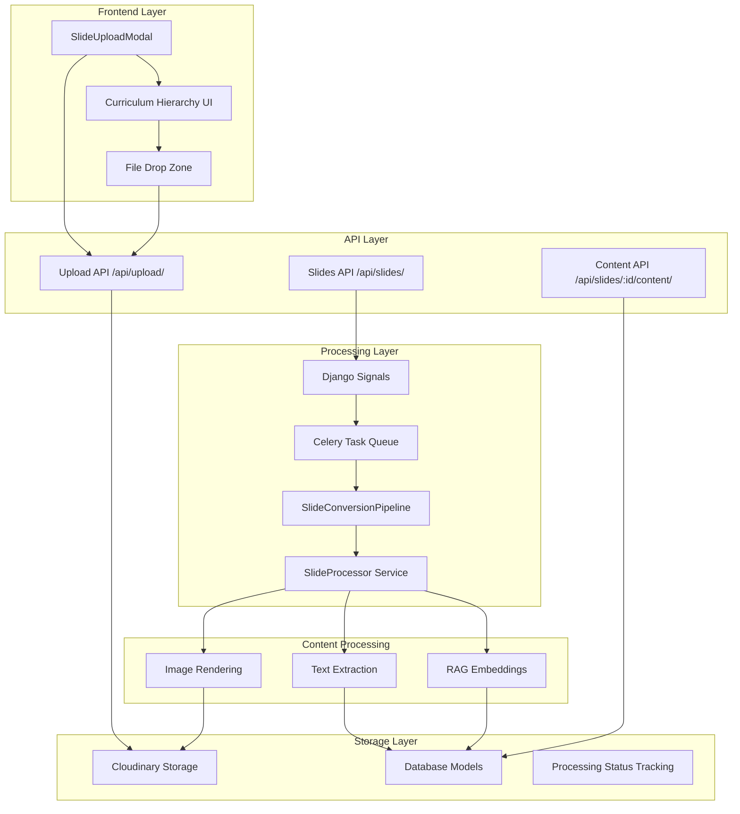
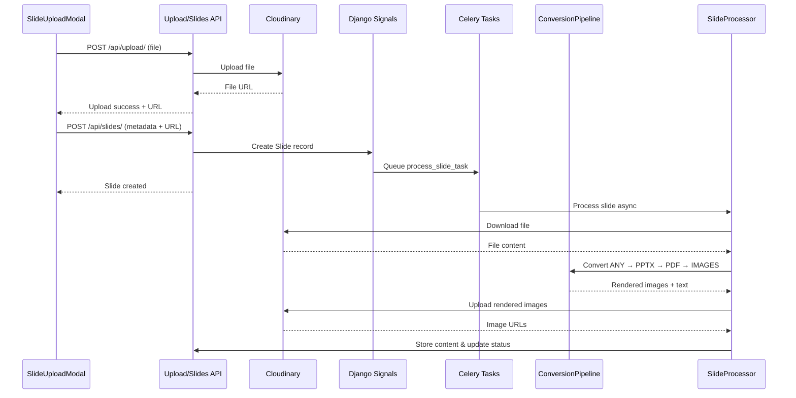
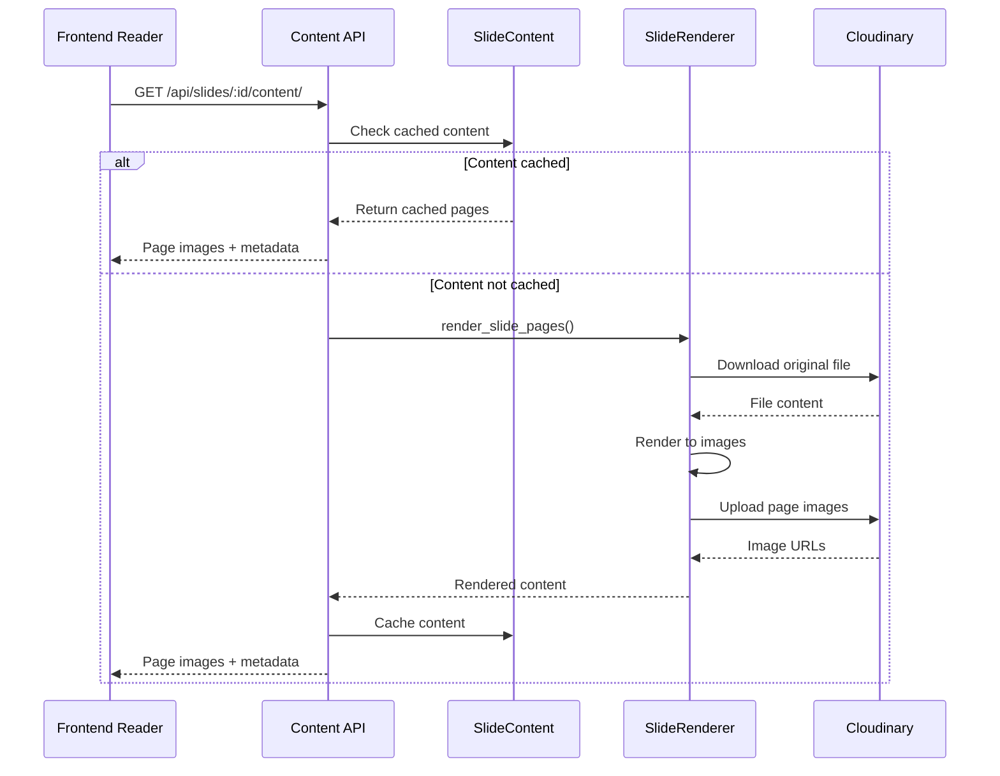

# Design Document: Slide Upload Processing System

## Overview

The slide upload processing system is a comprehensive asynchronous pipeline that handles the complete lifecycle of educational slide uploads. The system manages hierarchical curriculum organization (Subject → Block → Topic → Section), file uploads to Cloudinary, asynchronous conversion processing, text extraction for RAG embeddings, and rendered slide page storage for frontend consumption.

The system follows a multi-stage architecture where slides are uploaded through a React modal interface, processed through a robust conversion pipeline that normalizes any supported file format into standardized image pages, and made available for reading through a consistent API. The processing pipeline supports PDF, PPT, PPTX, and DOCX files, converting them through an intermediate format pipeline (ANY FILE → PPTX → PDF → IMAGES) to ensure consistent rendering across all file types.

## Architecture



## Sequence Diagrams

### Main Upload Flow



### Content Retrieval Flow



## Components and Interfaces

### Frontend Components

#### SlideUploadModal

**Purpose**: React component providing hierarchical curriculum navigation and file upload interface

**Interface**:

```typescript
interface SlideUploadModalProps {
  isModalOpen: boolean;
}

interface CurriculumHierarchy {
  subjects: Subject[];
  selectedSubject: SubjectId | null;
  selectedBlock: BlockId | null;
  selectedTopic: TopicId | null;
  selectedSection: string | null;
}

interface FileUploadState {
  file: File | null;
  title: string;
  errorMsg: string;
  dragging: boolean;
}
```

**Responsibilities**:

- Load and display curriculum hierarchy from API
- Handle hierarchical selection (Subject → Block → Topic → Section)
- Validate file types (PDF, PPT, PPTX, DOCX)
- Upload files to Cloudinary via /api/upload/
- Create slide records via /api/slides/
- Track upload progress and status

### Backend Services

#### SlideConversionPipeline

**Purpose**: Core conversion pipeline that normalizes all file types through standardized conversion steps

**Interface**:

```python
class SlideConversionPipeline:
    @staticmethod
    def process_slide(cloudinary_url: str, slide_id: str, original_file_type: str) -> Dict[str, Any]:
        """Complete pipeline: Download → PPTX → PDF → IMAGES"""

    @staticmethod
    def step1_to_pptx(input_file_path: str, output_dir: str) -> Tuple[bool, str]:
        """Convert ANY file type to PPTX using LibreOffice"""

    @staticmethod
    def step2_to_pdf(pptx_file_path: str, output_dir: str) -> Tuple[bool, str]:
        """Convert PPTX to PDF for text extraction"""

    @staticmethod
    def step3_pdf_to_images(pdf_file_path: str, output_dir: str, dpi: int = 150) -> Tuple[bool, List[str]]:
        """Convert PDF to PNG images for frontend rendering"""
```

**Responsibilities**:

- Download files from Cloudinary URLs
- Convert any supported format to PPTX using LibreOffice
- Convert PPTX to PDF for reliable text extraction
- Convert PDF pages to high-quality PNG images
- Extract text content from PDF for RAG processing
- Handle conversion errors and cleanup temporary files

#### SlideProcessor Service

**Purpose**: Orchestrates the complete slide processing workflow with validation and error handling

**Interface**:

```python
class SlideProcessor:
    @staticmethod
    def process_slide(slide: Slide) -> Dict[str, Any]:
        """Process slide through complete pipeline"""

    @staticmethod
    def validate_cloudinary_url(url: str) -> Tuple[bool, str]:
        """Validate Cloudinary URL format and accessibility"""

    @staticmethod
    def update_processing_status(slide, status: str, error_message: str = "", **kwargs):
        """Update slide processing status with detailed tracking"""

    @staticmethod
    def download_from_cloudinary(url: str, output_path: str, max_retries: int = 3) -> Tuple[bool, str]:
        """Download with retry logic and detailed error handling"""
```

**Responsibilities**:

- Coordinate the complete processing pipeline
- Validate file URLs and perform health checks
- Download files from Cloudinary with retry logic
- Update processing status throughout the workflow
- Handle text extraction and RAG processing
- Store processed content in database models
- Upload rendered images back to Cloudinary

## Data Models

### Core Models

#### Slide Model

```python
class Slide(models.Model):
    id = models.CharField(max_length=50, primary_key=True)
    title = models.CharField(max_length=200)

    # Curriculum hierarchy
    subject = models.ForeignKey(Subject, on_delete=models.CASCADE)
    block = models.ForeignKey(Block, on_delete=models.CASCADE)
    topic = models.ForeignKey(Topic, on_delete=models.CASCADE, null=True)
    section = models.ForeignKey(Section, on_delete=models.CASCADE, null=True)

    # File storage
    file = CloudinaryField('file', null=True, resource_type='auto')
    file_url = models.URLField(blank=True)
    file_type = models.CharField(max_length=20, default='pdf')
    page_count = models.IntegerField(default=0)

    # Metadata
    uploaded_by = models.ForeignKey(User, on_delete=models.SET_NULL, null=True)
    created_at = models.DateTimeField(auto_now_add=True)
```

**Validation Rules**:

- Title must be non-empty and max 200 characters
- Must have either file or file_url populated
- File type must be one of: pdf, pptx, ppt, docx
- Subject and block are required, topic and section optional
- Page count updated after successful processing

#### SlideContent Model

```python
class SlideContent(models.Model):
    slide = models.OneToOneField(Slide, on_delete=models.CASCADE, primary_key=True)

    is_extracted = models.BooleanField(default=False)
    extraction_error = models.TextField(blank=True)

    # JSON format: {"text": "...", "pages": [...], "total_pages": N}
    content_data = models.JSONField(default=dict, blank=True)

    extracted_at = models.DateTimeField(null=True, blank=True)
```

**Validation Rules**:

- Content data must include pages array with page_number, image_url, width, height
- Text content stored for RAG processing
- Extraction timestamp recorded for cache invalidation

#### SlideProcessingStatus Model

```python
class SlideProcessingStatus(models.Model):
    slide = models.OneToOneField(Slide, on_delete=models.CASCADE, primary_key=True)

    status = models.CharField(choices=[
        ('pending', 'Pending'),
        ('processing', 'Processing'),
        ('completed', 'Completed'),
        ('failed', 'Failed'),
    ], default='pending')

    # Detailed processing flags
    is_chunked = models.BooleanField(default=False)
    is_embedded = models.BooleanField(default=False)
    content_extracted = models.BooleanField(default=False)
    rag_processed = models.BooleanField(default=False)

    # Timestamps and error tracking
    started_at = models.DateTimeField(null=True)
    completed_at = models.DateTimeField(null=True)
    error_message = models.TextField(blank=True)
```

## Algorithmic Pseudocode

### Main Processing Algorithm

```pascal
ALGORITHM processMainWorkflow(slide_id)
INPUT: slide_id of type String
OUTPUT: result of type ProcessingResult

BEGIN
  ASSERT slide_id ≠ null AND slide_id ≠ ""

  // Step 1: Initialize and validate
  slide ← database.getSlide(slide_id)
  ASSERT slide ≠ null

  updateStatus(slide, "processing")

  file_url ← slide.file_url OR slide.file.url
  ASSERT file_url ≠ null

  valid, error ← validateCloudinaryUrl(file_url)
  IF NOT valid THEN
    updateStatus(slide, "failed", error)
    RETURN {success: false, error: error}
  END IF

  // Step 2: Download and convert
  temp_dir ← createTempDirectory()
  download_path ← downloadFromCloudinary(file_url, temp_dir)

  // Step 3: Process through conversion pipeline
  pipeline_result ← SlideConversionPipeline.process_slide(
    file_url, slide_id, slide.file_type
  )

  IF NOT pipeline_result.success THEN
    updateStatus(slide, "failed", pipeline_result.error)
    RETURN pipeline_result
  END IF

  // Step 4: Store rendered images in Cloudinary
  image_urls ← []
  FOR each image_path IN pipeline_result.image_paths DO
    cloudinary_result ← uploadToCloudinary(image_path, slide_id)
    image_urls.append(cloudinary_result.url)
  END FOR

  // Step 5: Store content in database
  content_data ← {
    text: pipeline_result.text_content,
    pages: createPagesArray(image_urls),
    total_pages: length(image_urls)
  }

  storeSlideContent(slide, content_data)

  // Step 6: Process with RAG if sufficient content
  IF length(pipeline_result.text_content) > 50 THEN
    rag_success ← ragService.processSlide(slide, temp_dir)
    updateStatus(slide, "completed", "", {rag_processed: rag_success})
  ELSE
    updateStatus(slide, "completed")
  END IF

  cleanupTempDirectory(temp_dir)

  RETURN {
    success: true,
    slide_id: slide_id,
    page_count: length(image_urls),
    text_length: length(pipeline_result.text_content)
  }
END
```

**Preconditions**:

- slide_id references an existing Slide record
- Slide has valid file_url or file.url
- Cloudinary service is accessible
- Processing pipeline dependencies are available

**Postconditions**:

- Processing status updated to 'completed' or 'failed'
- If successful: SlideContent created with pages and text
- If successful: Rendered images uploaded to Cloudinary
- Temporary files cleaned up
- RAG processing attempted if sufficient text content

**Loop Invariants**:

- Processing status remains consistent throughout execution
- Temporary directory exists and is writable during processing
- Database transaction integrity maintained for all updates

### Conversion Pipeline Algorithm

```pascal
ALGORITHM conversionPipeline(cloudinary_url, slide_id, file_type)
INPUT: cloudinary_url, slide_id, file_type
OUTPUT: conversion_result

BEGIN
  temp_dir ← createTempDirectory(slide_id)

  // Download original file
  original_path ← downloadFile(cloudinary_url, temp_dir)

  // Step 1: Convert to PPTX (normalizes all formats)
  IF file_type = "pptx" THEN
    pptx_path ← original_path
  ELSE
    pptx_path ← convertToPPTX(original_path, temp_dir)
    ASSERT fileExists(pptx_path)
  END IF

  // Step 2: Convert PPTX to PDF (for text extraction)
  pdf_path ← convertToPDF(pptx_path, temp_dir)
  ASSERT fileExists(pdf_path)

  // Extract text from PDF
  text_content ← extractTextFromPDF(pdf_path)

  // Step 3: Convert PDF to images (for frontend display)
  image_paths ← convertPDFToImages(pdf_path, temp_dir, dpi=150)
  ASSERT length(image_paths) > 0

  RETURN {
    success: true,
    image_paths: image_paths,
    text_content: text_content,
    page_count: length(image_paths)
  }

  FINALLY
    cleanupTempDirectory(temp_dir)
  END FINALLY
END
```

**Preconditions**:

- cloudinary_url is accessible and returns valid file
- LibreOffice is installed and accessible for conversions
- pdf2image library available for image generation
- Sufficient disk space for temporary files

**Postconditions**:

- Returns image paths for all converted pages
- Text content extracted from PDF
- All temporary files cleaned up
- Original file integrity preserved

## Key Functions with Formal Specifications

### Function: process_slide_task()

```python
def process_slide_task(slide_id: str) -> dict
```

**Preconditions:**

- `slide_id` references an existing Slide record
- Slide has valid file_url or file.url populated
- Celery worker environment is properly configured
- Database connection is available

**Postconditions:**

- Returns dictionary with success boolean and processing metadata
- Processing status updated in database (completed or failed)
- If successful: SlideContent record created with rendered pages
- If successful: Rendered images uploaded to Cloudinary with proper URLs
- Temporary files are cleaned up regardless of success/failure

### Function: render_slide_pages()

```python
def render_slide_pages(file_url: str, file_type: str, slide_id: str) -> dict
```

**Preconditions:**

- `file_url` is accessible Cloudinary URL
- `file_type` is supported format (pdf, pptx, ppt, docx)
- `slide_id` is valid identifier for naming/organization

**Postconditions:**

- Returns dict with 'total_pages' and 'pages' array
- Each page contains: page_number, image_url, width, height
- All page images uploaded to Cloudinary under slides/{slide_id}/ folder
- Page numbering starts from 1 and is sequential

### Function: validateCloudinaryUrl()

```python
def validate_cloudinary_url(url: str) -> Tuple[bool, str]
```

**Preconditions:**

- `url` parameter is provided (may be null/empty)

**Postconditions:**

- Returns (True, "") if URL is valid and accessible
- Returns (False, error_message) if URL is invalid or inaccessible
- No side effects on system state
- Network requests are bounded by timeout

## Example Usage

### Frontend Upload Flow

```typescript
// 1. User selects curriculum hierarchy
const hierarchy = {
  subject: "anatomy",
  block: "anatomy-block-1",
  topic: "gross-anatomy",
  section: "upper-limb",
};

// 2. User drops file and enters title
const file = new File([pdfBlob], "axilla-anatomy.pdf");
const title = "Axilla: Boundaries & Contents";

// 3. Upload file to Cloudinary
const uploadResponse = await fetch("/api/upload/", {
  method: "POST",
  body: formData, // contains file
});
const { url: file_url } = await uploadResponse.json();

// 4. Create slide record
const slideResponse = await fetch("/api/slides/", {
  method: "POST",
  headers: { "Content-Type": "application/json" },
  body: JSON.stringify({
    title,
    subject: hierarchy.subject,
    block: hierarchy.block,
    topic: hierarchy.topic,
    section: hierarchy.section,
    file_url,
    file_type: "pdf",
  }),
});

// 5. Processing happens automatically via Django signals
```

### Backend Processing Pipeline

```python
# Automatic processing via Django signals
@receiver(post_save, sender=Slide)
def auto_process_slide_after_upload(sender, instance, created, **kwargs):
    if created and (instance.file or instance.file_url):
        process_slide_task.delay(instance.id)

# Celery task execution
@shared_task
def process_slide_task(slide_id: str):
    slide = Slide.objects.get(id=slide_id)

    # Process through conversion pipeline
    result = SlideConversionPipeline.process_slide(
        cloudinary_url=slide.file_url,
        slide_id=slide_id,
        original_file_type=slide.file_type
    )

    if result['success']:
        # Upload images and store content
        for idx, image_path in enumerate(result['image_paths'], 1):
            cloudinary_result = cloudinary.uploader.upload(
                image_path,
                folder=f"emby/slides/{slide_id}",
                public_id=f"page_{idx:04d}"
            )

        # Store in database
        slide_content = SlideContent.objects.create(
            slide=slide,
            content_data={
                'text': result['text_content'],
                'pages': pages_data,
                'total_pages': len(pages_data)
            },
            is_extracted=True
        )
```

### Content Retrieval

```python
# Frontend requests slide content
GET /api/slides/anatomy-slide-123/content/

# Backend checks cache and renders if needed
def get_slide_content(request, slide_id):
    slide = get_object_or_404(Slide, id=slide_id)

    try:
        # Check if content is cached
        slide_content = slide.content
        if slide_content.is_extracted:
            return Response(slide_content.content_data)
    except SlideContent.DoesNotExist:
        pass

    # Render pages if not cached
    content = render_slide_pages(slide.file_url, slide.file_type, slide_id)

    # Cache the result
    SlideContent.objects.update_or_create(
        slide=slide,
        defaults={
            'content_data': content,
            'is_extracted': True,
            'extracted_at': timezone.now()
        }
    )

    return Response(content)
```

## Correctness Properties

### Universal Quantification Statements

**P1: Processing Completeness**

```
∀ slide ∈ ProcessedSlides :
  slide.processing_status.status = "completed" ⟹
    (∃ content ∈ SlideContent : content.slide = slide ∧
     content.is_extracted = true ∧
     |content.content_data.pages| > 0)
```

**P2: File Format Consistency**

```
∀ slide ∈ Slides :
  slide.file_url ≠ null ∧ slide.processing_status.status = "completed" ⟹
    (∀ page ∈ slide.content.content_data.pages :
     isValidImageUrl(page.image_url) ∧
     page.page_number ≥ 1 ∧
     page.width > 0 ∧ page.height > 0)
```

**P3: Curriculum Hierarchy Integrity**

```
∀ slide ∈ Slides :
  slide.subject ≠ null ∧ slide.block ≠ null ∧
  (slide.topic ≠ null ⟹ slide.topic.block = slide.block) ∧
  (slide.section ≠ null ⟹
   (slide.section.topic = slide.topic ∨ slide.section.block = slide.block))
```

**P4: Processing Status Consistency**

```
∀ slide ∈ Slides :
  slide.processing_status.status = "processing" ⟹
    slide.processing_status.started_at ≠ null ∧
    slide.processing_status.completed_at = null
```

**P5: Content Extraction Invariant**

```
∀ slide ∈ Slides :
  slide.processing_status.content_extracted = true ⟹
    (∃ content ∈ SlideContent :
     content.slide = slide ∧
     content.is_extracted = true ∧
     |content.content_data.text| ≥ 0)
```

## Error Handling

### Error Scenario 1: Cloudinary Download Failure

**Condition**: Network timeout or 404 error when downloading file from Cloudinary URL
**Response**: Retry up to 3 times with exponential backoff, then mark as failed
**Recovery**: Update processing status with specific error message, allow manual reprocessing

### Error Scenario 2: LibreOffice Conversion Failure

**Condition**: LibreOffice fails to convert file (corrupted file, unsupported format, missing dependencies)
**Response**: Log detailed error message, attempt alternative conversion methods if available
**Recovery**: Mark slide as failed with conversion error, provide reprocessing endpoint

### Error Scenario 3: PDF Text Extraction Failure

**Condition**: PDF is image-based or corrupted, no extractable text content
**Response**: Continue processing for image rendering, log warning about missing text
**Recovery**: Store empty text content, disable RAG features for this slide

### Error Scenario 4: Image Rendering Failure

**Condition**: pdf2image fails to convert PDF pages to images
**Response**: Try alternative rendering methods, reduce DPI if memory issues
**Recovery**: If all methods fail, mark as failed and store error details

### Error Scenario 5: Database Storage Failure

**Condition**: Database connection lost or constraint violation during content storage
**Response**: Retry database operations, ensure transaction rollback on failure
**Recovery**: Preserve processed content in temporary storage, retry when database available

## Testing Strategy

### Unit Testing Approach

Focus on individual component testing with comprehensive mock coverage:

- **SlideConversionPipeline**: Test each conversion step independently with sample files
- **SlideProcessor**: Mock Cloudinary interactions and test processing logic
- **File Type Detection**: Test magic byte detection with various file formats
- **Text Extraction**: Test with known PDF/DOCX samples and verify output
- **URL Validation**: Test edge cases and malformed URLs

**Coverage Goals**: >90% line coverage for core processing logic, 100% for utility functions

### Property-Based Testing Approach

**Property Test Library**: Hypothesis (Python)

**Key Properties to Test**:

1. **Processing Idempotency**: Processing the same file multiple times yields identical results
2. **File Format Invariants**: All supported file types produce valid page arrays
3. **URL Generation**: Generated Cloudinary URLs are always valid and accessible
4. **Content Consistency**: Page count matches between pipeline output and stored content
5. **Error Propagation**: All processing errors are properly captured and stored

**Property Test Examples**:

```python
@given(file_content=binary(min_size=1000, max_size=1000000))
def test_conversion_pipeline_handles_arbitrary_content(file_content):
    # Test that pipeline gracefully handles any binary content
    result = process_arbitrary_file(file_content)
    assert 'success' in result
    assert 'error' in result
    # Pipeline should never crash, always return structured result

@given(slide_data=slide_data_strategy())
def test_processing_status_consistency(slide_data):
    # Test that processing status transitions are always valid
    slide = create_slide(slide_data)
    process_slide_task(slide.id)
    status = slide.processing_status
    assert status.status in ['completed', 'failed']
    if status.status == 'completed':
        assert status.completed_at is not None
        assert slide.content.is_extracted == True
```

### Integration Testing Approach

**End-to-End Workflow Testing**:

- Upload real sample files through complete pipeline
- Verify Cloudinary uploads and downloads
- Test with various file formats and sizes
- Validate database consistency after processing
- Test error recovery scenarios with network failures

**API Integration Testing**:

- Test upload endpoints with multipart form data
- Verify slide creation and processing triggers
- Test content retrieval API with caching behavior
- Validate status endpoints during processing

## Performance Considerations

**File Size Limits**: Maximum 50MB per upload to prevent memory issues during processing

**Processing Timeouts**:

- Celery task timeout: 600 seconds (10 minutes)
- Cloudinary download timeout: 60 seconds
- LibreOffice conversion timeout: 300 seconds

**Memory Management**:

- Process files in streaming mode where possible
- Clean up temporary directories immediately after processing
- Use memory-efficient PDF processing libraries (PyMuPDF)

**Concurrency**:

- Celery worker pool size configured based on server resources
- Rate limiting on upload endpoints to prevent abuse
- Database connection pooling for high concurrent access

**Caching Strategy**:

- SlideContent acts as processed content cache
- Cloudinary CDN provides image delivery optimization
- Database indexes on frequently queried fields (subject, block, processing status)

## Security Considerations

**File Upload Security**:

- Magic byte validation to prevent file type spoofing
- File size limits to prevent DoS attacks
- Virus scanning integration point for uploaded files
- Secure temporary file handling with proper cleanup

**Access Control**:

- Authentication required for all upload and processing operations
- Role-based permissions (only class reps and uploaders can add slides)
- User isolation for personal content and progress tracking

**Data Privacy**:

- No sensitive data stored in slide content
- Cloudinary URLs use secure HTTPS connections
- Processing logs exclude user-identifiable information
- Temporary files cleaned up to prevent data leakage

**Infrastructure Security**:

- Celery tasks run in isolated worker processes
- Database credentials managed through environment variables
- Cloudinary API keys restricted to necessary operations only
- Network timeouts prevent resource exhaustion

## Dependencies

**Core Dependencies**:

- **Django 4.x**: Web framework and ORM
- **Celery**: Async task processing
- **Cloudinary**: File storage and CDN
- **LibreOffice**: Office document conversion (soffice command-line)
- **pdf2image**: PDF to image conversion
- **PyMuPDF (fitz)**: PDF text extraction
- **Pillow**: Image processing
- **python-docx**: DOCX text extraction
- **python-pptx**: PPTX text extraction

**System Dependencies**:

- **Redis**: Celery message broker
- **PostgreSQL**: Primary database
- **LibreOffice Headless**: Document conversion service

**Optional Enhancements**:

- **Tesseract OCR**: For image-based PDF text extraction
- **Virus scanning service**: For uploaded file security
- **Monitoring tools**: For processing pipeline observability
